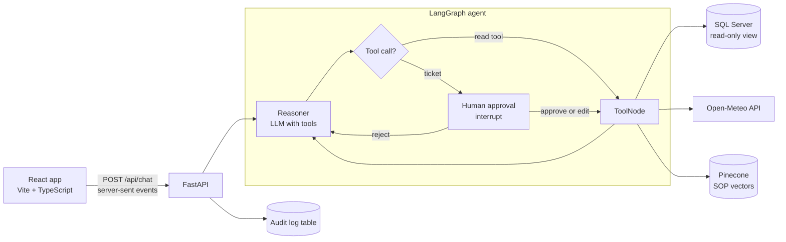

# Cold-Chain Copilot

An AI dispatch agent for cold-chain logistics. It investigates temperature breaches and route disruptions by reading fleet telemetry, checking live corridor weather and searching your standard operating procedures (SOPs). When it wants to **act**, it stops and asks a human first.

<p align="center">
  <video src="docs/media/supply-chain-journey.mp4" poster="docs/media/supply-chain-journey-poster.jpg" controls muted loop width="100%"></video>
</p>

<p align="center">
  <em>The "Supply chain journey" page: a refrigerated truck leaves the packing house and must stay between 0 and 4 °C all the way to the store. This is an illustration, not live data.</em><br>
  <a href="docs/media/supply-chain-journey.mp4">Open the video</a> if the player does not load.
</p>

## What it does

- **An agent that decides what to check.** Ask a question in plain language. The agent chooses which tools to call, in which order, and writes an operational report with the SOP clause it relied on.
- **A human approves every action.** Opening an incident ticket pauses the agent. You can approve it, edit the arguments, or reject it with a reason. Nothing runs until you decide.
- **A full audit trail.** Every proposal, decision and tool result is written to a SQL table that only an administrator can read.
- **An animated supply chain journey.** Follow a shipment from the packing house to the store in three scenarios (normal, temperature breach, port congestion) and see where the agent steps in. The thresholds come from the SOP in `data/policy`.
- **A demo mode.** A scripted agent with canned data lets you explore the whole app with no API key and no database.

| Tool | What it does | Needs approval |
| :--- | :--- | :---: |
| `query_telemetry_db` | Reads fleet sensors from SQL Server, through a read-only view | No |
| `fetch_corridor_conditions` | Live weather and wind along the road (Open-Meteo) | No |
| `search_compliance_sop` | Semantic search over the SOPs stored in Pinecone | No |
| `create_incident_ticket` | Opens an incident ticket in SQL Server | **Yes** |

## Architecture



The agent is a LangGraph state machine. The `interrupt()` call in the approval node saves the whole conversation state, so the agent can wait for a human for as long as needed and then resume exactly where it stopped. The FastAPI server streams each step to the browser as it happens.

## Tech stack

| Layer | Technology |
| :--- | :--- |
| Agent | LangGraph, LangChain |
| LLM (switchable with one setting) | OpenAI GPT-4o, DeepSeek, or a local model through Ollama |
| SOP search | Pinecone, with BGE-M3 (local) or OpenAI embeddings |
| Data | SQL Server 2022 |
| API | FastAPI, server-sent events |
| Interface | React 19, TypeScript, Vite |
| Previous interface | Streamlit (`src/ui.py`, still included) |
| Packaging | Docker, Docker Compose |
| Quality | pytest, Vitest, GitHub Actions |

## Quick start

### 1. Try the demo (no keys, no database)

```bash
pip install -r requirements.txt
cd frontend
npm install
npm run build
cd ..
```

Start the server in demo mode.

PowerShell:

```powershell
$env:COLDCHAIN_DEMO = "1"
uvicorn src.api:create_app --factory --port 8000
```

macOS and Linux:

```bash
COLDCHAIN_DEMO=1 uvicorn src.api:create_app --factory --port 8000
```

Open <http://localhost:8000>. On the audit page, sign in with `demo` / `demo`.

### 2. Work on the interface

Run the API as above, then in a second terminal:

```bash
cd frontend
npm run dev
```

Open <http://localhost:5173>. The page reloads on every change and `/api` is proxied to the backend.

### 3. Run the real agent

1. Copy `.env.example` to `.env` and fill it in: the LLM you chose in `Agent_llm` and its key, `PINECONE_API_KEY`, and the two SQL passwords. The SQL passwords must follow SQL Server's policy (upper case, lower case, a digit and a symbol).
2. Start SQL Server and create the tables and the read-only view:

```bash
docker compose up -d db
python scripts/init_database.py
```

3. Load the SOPs into Pinecone (once):

```bash
python scripts/ingest_sop_pinecone.py
```

4. Start the server without `COLDCHAIN_DEMO` and open <http://localhost:8000>.

### 4. Everything in Docker

```bash
docker compose up --build
```

This starts SQL Server, loads the dataset and creates the tables once (it skips them on later runs), then starts the app on <http://localhost:8000>. It needs a `.env` with at least the two SQL passwords. Add `COLDCHAIN_DEMO=1` to use the scripted agent. Load the SOPs with `docker compose --profile ingest run --rm sop-ingest`.

## Configuration

| Variable | Purpose |
| :--- | :--- |
| `Agent_llm` | `OPENAI`, `DEEPSEEK` or `OLLAMA` |
| `Embeddings_model` | `LOCAL` (BGE-M3, runs on CPU) or `OPENAI` |
| `PINECONE_API_KEY`, `DEEPSEEK_API_KEY`, `OPENAI_API_KEY` | Keys for the services you use |
| `SQL_SERVER_HOST`, `SQL_SERVER_PORT` | Where SQL Server is (`localhost:1433` by default) |
| `SQL_ADMIN_USER`, `SQL_ADMIN_PASSWORD` | Administrator account: creates the schema and reads the audit trail |
| `SQL_AGENT_USER`, `SQL_AGENT_PASSWORD` | The agent's account, with minimal rights |
| `COLDCHAIN_DEMO` | `1` runs the scripted agent |

## Security design

- **The agent's database account is read-only.** It can read one view. The raw table is denied, and it can only insert into the audit and ticket tables. It cannot read the audit log, edit a ticket or delete anything. These rules were checked against a real SQL Server in Docker.
- **Actions need a human.** A malformed or missing decision is treated as a rejection.
- **The audit trail needs an administrator.** The server compares credentials in constant time, delays failed attempts, and keeps the session token in memory only.
- **No secret in the repository or the image.** Secrets live in `.env`, which is git-ignored and excluded from the Docker build.
- **Known limit:** the SQL tool also checks that a query starts with `SELECT`, which is a basic guard. The database permissions are the real protection.

## Tests

```bash
pytest
cd frontend
npm test
```

134 automated tests (86 in Python, 48 in the frontend). They use a fake LLM and fake services, so they need no key and no database. They cover the approval flow, the tools, the API, the audit rules, the interface behaviour and the consistency between the code and the SQL scripts. GitHub Actions runs three jobs on every push: the Python tests, the frontend tests and build, and the Docker build.

## Project structure

```
src/
  agent_graph.py     LangGraph wiring and the human approval step
  orchestrator.py    LLM selection and the real agent
  agent_tools.py     Read tools: telemetry, weather, SOP search
  action_tools.py    The ticket tool
  api.py             FastAPI app, streaming and admin endpoints
  audit.py           Audit trail (SQL, or in memory for the demo)
  demo_agent.py      Scripted agent for the demo mode
  ui.py              Previous Streamlit interface
frontend/            React app (journey, console, audit)
scripts/             Database setup, dataset loading, SOP ingestion
data/                Dataset and the SOP documents
tests/               Python tests
docs/                Diagrams and media
```

## Limitations and next steps

- The journey animation is an illustration. It is not connected to live telemetry.
- The quality of a real LLM's answers is not measured by automated checks yet. An evaluation set that scores which tool the agent picks is the next step.
- Planned: expose the read tools through an MCP server, and replace the `SELECT` prefix check with a proper SQL parser.


