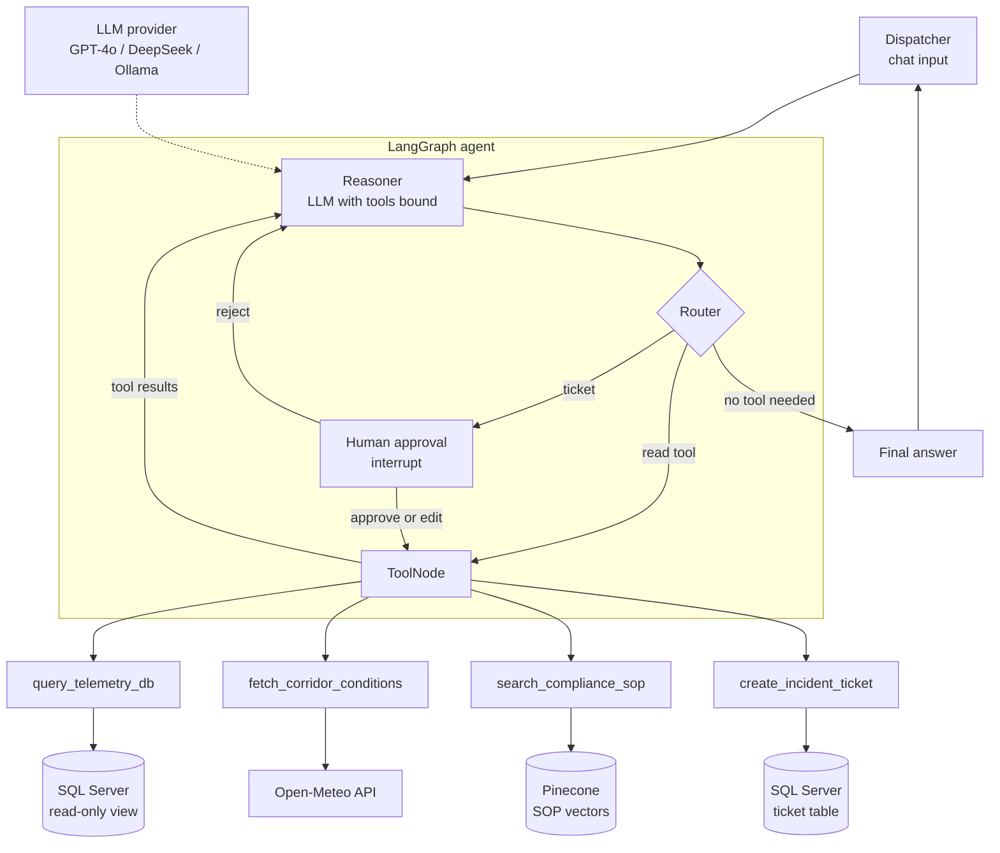

# Agent graph

```mermaid
flowchart TD
    U[Dispatcher<br/>chat input] --> R

    subgraph AGENT[LangGraph agent]
        R[Reasoner<br/>LLM with tools bound]
        C{Router}
        T[ToolNode]
        H[Human approval<br/>interrupt]
        R --> C
        C -- read tool --> T
        C -- ticket --> H
        H -- approve or edit --> T
        H -- reject --> R
        T -- tool results --> R
    end

    LLM[LLM provider<br/>GPT-4o / DeepSeek / Ollama] -.-> R
    C -- no tool needed --> A[Final answer]
    A --> U

    T --> T1[query_telemetry_db]
    T --> T2[fetch_corridor_conditions]
    T --> T3[search_compliance_sop]
    T --> T4[create_incident_ticket]

    T1 --> S1[(SQL Server<br/>read-only view)]
    T2 --> S2[Open-Meteo API]
    T3 --> S3[(Pinecone<br/>SOP vectors)]
    T4 --> S4[(SQL Server<br/>ticket table)]
```
